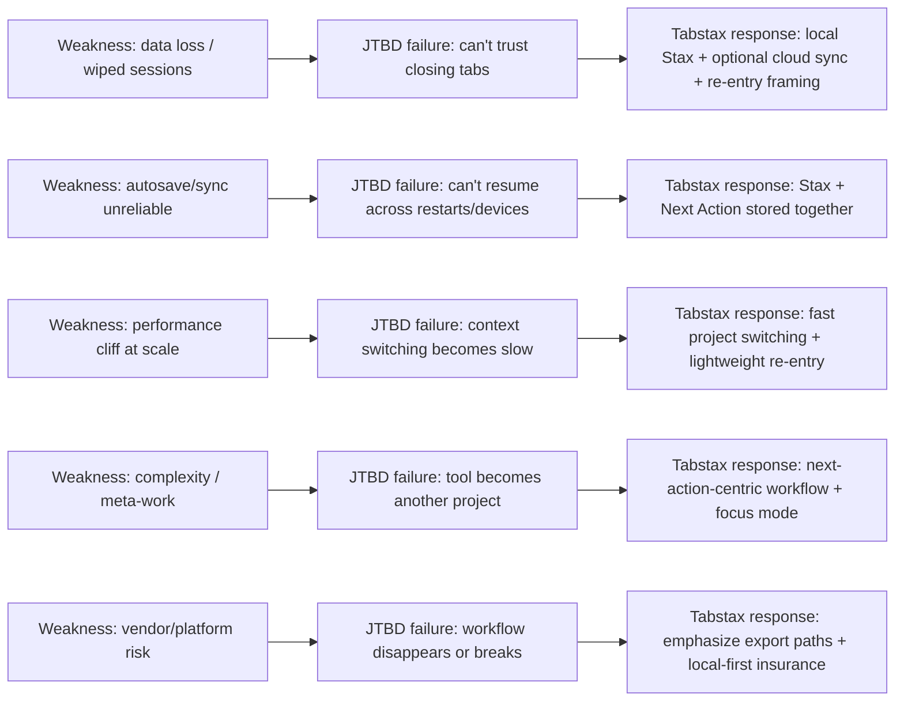

# Competitor Weaknesses and Complaint Patterns Across Tab Managers, Workspaces, PKM, Browsers, and DIY Routines

## Executive summary

User complaints across tab/session managers, workspace tools, PKM, and “read-it-later” products cluster around a small set of repeatable failure modes: (a) trust breaks from lost data, (b) performance collapse at scale, (c) complexity that creates “meta-work,” (d) sync/offline friction, (e) pricing and plan volatility, and (f) vendor/platform risk (shutdowns, extension removals, browser API changes). These are not edge cases; they show up in store reviews, support docs, product forums, and long-running community threads. citeturn26view2turn26view1turn27view0turn21view1turn18search3turn12search0

The sharpest competitive wedge is not “better tab grouping.” It is “reliable re-entry”: when people return to work, they need the exact workspace plus an unambiguous next action, without paying a reconstruction tax. Tabstax explicitly positions around that re-entry problem (remember what mattered → recover where you left off → decide what to do next) and puts Next Actions at the center, including features like an attention-prioritization board and a single-action focus mode. citeturn5search1

From a defensible content strategy standpoint, the strongest evidence-backed angles are: “data-loss horror stories,” “scale/performance cliffs,” “sync and offline reality,” “extension ecosystem risk,” and “tools that enable hoarding instead of finishing.” Each of these can be anchored to primary sources (store reviews, official support docs, issue trackers) and then mapped to a crisp JTBD failure + Tabstax counter-claim. citeturn21view0turn28view2turn23view1turn22search0turn8news40turn5search1

## Sources and method

This report triangulates “negative themes” using primary and community sources in English:  
- Store reviews: Firefox Add-ons reviews (e.g., Tab Session Manager, Workona). citeturn21view0turn28view2  
- App Store reviews: Instapaper and Readwise Reader review excerpts. citeturn15view1turn13view2  
- B2B review platforms: G2 and Capterra “pros & cons” and review excerpts (Notion, Workona, Raindrop.io, Zotero). citeturn23view1turn17search16turn25search3turn16search0  
- Community threads: Reddit (including r/ADHD and r/Journalism), plus enthusiast/productivity forums. citeturn22search0turn22search9turn22search2turn28view1  
- Hacker News: discussion threads containing performance/privacy complaints and “tab state” JTBD framing. citeturn6search1turn8search10turn12search9  
- Product issue trackers and docs: GitHub issues/discussions and official support docs (Tabli issues, Zotero docs, Session Buddy warnings). citeturn10view1turn16search10turn0search5turn20view1

Quotes are kept to ≤25 words each and are presented as evidence of recurring complaint types (not as statistical prevalence claims). citeturn21view0turn15view1turn23view1

## Recurring weakness categories and what users complain about

The market’s negative themes compress into ten defensible weakness categories. Each category is tied to specific, quotable evidence, and each creates a clear attack surface.

### Weakness categories overview

| Weakness category | What it looks like in the wild | Representative evidence anchors |
|---|---|---|
| Data loss and irrecoverable states | Sessions/tabs wiped, no recovery path, backups missing or unusable | OneTab “no way to recover” threads; Session Buddy “history deleted”; Tab Session Manager “randomly deleted ALL sessions” citeturn26view2turn26view1turn21view1 |
| Autosave/sync unreliability | Autosave not working; cloud not syncing; conflicts and repeated prompts | Tab Session Manager autosave complaints; TabXpert “cloud not syncing”; Zotero conflict resolution loops citeturn21view0turn19view0turn16search5 |
| Performance cliff at scale | Lag/freezes at high tab or session counts; sluggish “heavy workspaces” | Notion sluggish at scale; Tab Session Manager lag after 1000+ sessions; Vivaldi “way too slow” citeturn23view1turn21view0turn29view2 |
| Complexity and overhead | Setup becomes a project; “meta-work” to maintain the system | Workona setup “tedious”; Notion learning curve; Tab tools that require manual pruning/archiving hacks citeturn17search0turn23view1turn24view0 |
| Plan limits, pricing pressure, and upsell friction | Paywalls for core value; surprise restrictions; “nagging” | Workona surprise tier lock / popups; Readwise price sensitivity; Raindrop “Pro full-text search” ambiguity citeturn28view1turn13view2turn25search0 |
| Mobile and offline gaps | Offline use limited; mobile apps “unusable” or suboptimal; no Android app | Notion offline limitations + mobile pain; Workona “doesn’t have an Android app”; Raindrop app suboptimal citeturn23view1turn24view0turn17search16turn25search6 |
| Compatibility and platform churn | Browser updates break extensions; MV2→MV3 migration; features removed | Session Buddy upgrade warnings; Chrome MV3 wave disables extensions; Tab tool breakages after updates citeturn0search5turn8news40turn21view1 |
| Privacy and trust risk | Suspicion about telemetry/data upload; permissions concern | Arc data-upload suspicion on HN; Tabli permission concern; Great Suspender malware incident citeturn6search1turn9search10turn18search3 |
| Vendor/product risk (shutdowns, delistings) | Entire product shuts down or is delisted; users forced to migrate | Pocket shutdown timeline; Session Buddy temporarily removed; Great Suspender disabled/delisted citeturn12search0turn0search9turn18search4 |
| Doesn’t solve the real JTBD (enables hoarding) | “Saved” becomes a graveyard; closing tabs loses meaning; systems encourage accumulation | r/ADHD: OneTab “enabled the problem”; HN: can’t close tabs due to losing state; Pocket becomes “gigantic long list” citeturn22search0turn8search10turn12search9 |

### Evidence-backed patterns that matter strategically

Data loss is the most commercially exploitable weakness because it turns “productivity” tools into “risk exposure.” One of the most repeated motifs is a user realizing that saved sessions/tabs have silently vanished—followed by “is it gone for good?” This shows up in tab managers (OneTab, Session Buddy), session managers (Tab Session Manager), and even workspace-style products (Workona) when state becomes inconsistent or overwritten. citeturn26view2turn26view1turn21view1turn28view2

Scale failures (slowness, lag, freezing) appear both in “web app workspaces” (Notion) and in “list-of-sessions” tools once the artifact count gets large (e.g., 1000+ sessions). The failure mode is predictable: the system is fine at 50 items, then collapses at 500–2000, exactly when heavy users need it most. citeturn23view1turn21view0turn24view0

For neurodivergent and journalism-adjacent users, a key substitute dynamic is that tab tools often become an “anxiety buffer” rather than a completion engine: the comfort is “knowing they’re there,” but the backlog grows until it becomes unmanageable. A r/ADHD user explicitly describes OneTab as enabling tab hoarding (“my OneTab has 1800 tabs”). Meanwhile, journalists normalize “20 or more tabs open” as a baseline for covering multiple stories, which intensifies the scale and re-entry problems. citeturn22search0turn22search2

Vendor and platform risk is no longer hypothetical. Pocket’s shutdown is fully documented (including exact dates), and The Great Suspender incident is a canonical “extension trust collapse” where Chrome disabled/delisted an extension “because it contains malware.” These events train users to distrust “critical workflow” dependencies that can disappear or break due to external forces. citeturn12search0turn18search3turn8news40

## Product-by-product complaints with representative quotes

Each row below lists (a) three recurring complaints, (b) one representative quote (≤25 words), and (c) a primary/community source link via citation.

| Product | Top recurring complaints (themes) | Representative quote (≤25 words) | Source |
|---|---|---|---|
| Notion | Performance at scale; learning curve; weak offline | “Heavy workspaces can occasionally feel sluggish.” | citeturn23view1 |
| OneTab | Data loss/no recovery; reinstall/migration risk; manual backup burden | “No way to recover the OneTab user data once it’s flushed and overwritten.” | citeturn26view2 |
| Toby | Missing/locked “core” features; sync expectations gap; pricing anxiety | “It’s good but I need multi space and sync.” | citeturn26view0 |
| Workona | Duplicates/mislabeled tabs; overwrites state; slow/buggy on some setups | “Disorganized, duplicated, and mislabeled tabs.” | citeturn28view2 |
| Session Buddy | Collections/history wiped; upgrade/migration hazards; backup reliance | “Deleted all Collections and History by itself for no apparent reason.” | citeturn26view1 |
| Tabs Outliner | Lost data after clearing cookies/cache; breakage/empty UI; poor support | “Cleared my cookies/cache and… it nuked my tabs outliner tree.” | citeturn27view0 |
| Tabli | Conflicts with browser tab search; permissions discomfort; lag at high tab counts | “Disabling the Tabli extension causes the Chrome Tabs List to work properly.” | citeturn10view1 |
| TabXpert | Cloud sync failures; crash-induced duplication/corruption; plan churn/ads | “Cloud is not syncing at all, and no tab sessions remain.” | citeturn19view0 |
| Raindrop | AI tagging errors; app experience suboptimal; “Pro vs Free” search clarity | “AI tagging… making errors more time consuming than going through them by hand.” | citeturn25search3 |
| Zotero | Storage quota blocks PDF sync; conflict resolution friction; collaboration scaling issues | “Hit the free limit… can’t sync new pdfs to a new machine.” | citeturn16search2 |
| Arc | High RAM/CPU + battery drain; privacy/telemetry suspicion; performance volatility | “RAM usage… bumps to 8GB… ends up with more than 600MB upload.” | citeturn6search1 |
| Vivaldi | Slowness/lag; heavy UI; performance regressions perceived by users | “One of my biggest gripes… it’s speed, it’s way too slow.” | citeturn29view2 |
| Pocket | Product shutdown/vendor risk; forced migration/export; backlog never read | “Pocket shut down… July 8, 2025.” | citeturn12search0 |
| Instapaper | Sync/new saves not appearing; slow loading; premium regret | “Waited over five minutes… wouldn’t show me any of my recent saves.” | citeturn15view1 |
| Readwise Reader | Price sensitivity; subscription fatigue; “value vs cost” tension | “8–9 dollars per month… is STEEP.” | citeturn13view2 |
| Tab Wrangler | “Locked” tabs still close; workflow friction to relock; reliability doubts | “I’m wrangling the wrangler more than it is wrangling the tabs.” | citeturn20view1 |
| Tab Session Manager | Autosave failures; random session deletions; backup defaults too weak | “Autosave for sessions does absolutely nothing… whole point… moot.” | citeturn21view0 |
| The Great Suspender | Malware/trust collapse; disabled/delisted; broken suspended-tab recovery | “Been disabled because it contains malware.” | citeturn18search3 |

Notes on “store review” evidence: Tab Session Manager and Workona have directly quotable Firefox Add-ons review text; Instapaper and Readwise Reader have directly quotable App Store review excerpts. citeturn21view0turn28view2turn15view1turn13view2

## JTBD failure mapping and Tabstax counter-claims

Tabstax’s own positioning is explicitly JTBD-framed: “Never pay the ‘what was I doing?’ tax again,” describing the reconstruction steps users face when returning to a project (remember → recover → decide next). Its core counter-claims center on Next Actions, fast context switching via an extension, attention prioritization (“Must/Should/Good/Meh”), and a single-action focus mode. Pricing/tiers are also positioned as “Free (no account needed) with unlimited local Stax” vs “Pro with cloud sync and sharing/collaboration.” citeturn5search1

### Weakness → JTBD failure → Tabstax response

| Weakness category | JTBD failure (what user can’t reliably do) | Tabstax counter-claim (positioning) | Proof asset to make the claim defensible |
|---|---|---|---|
| Data loss / irrecoverable sessions | “I can’t close tabs because I don’t trust I’ll get them back.” | Emphasize re-entry engine + local-first Free tier + optional cloud sync. citeturn5search1 | Publish a “recovery guarantee” checklist + export/migration guides; show local + synced behavior on video |
| Autosave/sync unreliability | “I can’t rely on autosave/sync under crashes/updates.” | Position “next action + workspace together” and “cloud sync across devices” (Pro). citeturn5search1 | Test matrix: crash/restart/device swap; document outcomes with timestamps |
| Performance cliff at scale | “My system gets slow exactly when I’m overloaded.” | Position “fast context switching” and “switch projects like switching tabs.” citeturn5search1 | Benchmarks: open/restore 50/200/1000 tabs in controlled environments |
| Complexity/overhead | “The tool becomes another project to manage.” | Position “Next Actions at the Center” + simple re-entry instead of heavy PM overhead. citeturn5search1 | Before/after flows: time-to-re-enter, time-to-capture next step |
| Pricing/upsell friction | “I get interrupted with nags or abrupt limits.” | Position meaningful Free tier (“no account needed”) and clear Pro value. citeturn5search1 | Transparent pricing page + “what’s free forever” policy post |
| Mobile/offline gaps | “I can’t capture/act when offline or on the wrong device.” | Position local-first Free, plus multi-surface capture concept (extension + web app + CLI). citeturn5search1 | Document offline behavior; roadmap transparency for planned surfaces |
| Compatibility/platform churn | “A browser update broke my whole workflow.” | Minimize reliance on brittle APIs; publish compatibility commitments and export paths. (Strategic gap to address.) citeturn8news40turn5search1 | Compatibility changelog + “how to backup/export” prompts in-product |
| Privacy/trust risk | “I’m uneasy about what this tool can see/send.” | Leverage “no account needed” baseline and publish clear data handling; avoid overclaiming. citeturn5search1 | Permission audit post + threat-model FAQ + independent review |
| Vendor shutdown risk | “My archive disappeared overnight.” | Position exportability + “local Stax” as an insurance policy. citeturn12search0turn5search1 | “If Tabstax disappeared tomorrow” export plan + open formats |
| Doesn’t solve real JTBD (enables hoarding) | “Saving creates a graveyard; I still don’t know what to do next.” | Position Next Actions + Focus Mode (“play button… full-screen single action”) and attention allocation board. citeturn5search1 | Case studies: backlog-to-finish; “return rate” and “time-to-first-action” metrics |

### Mermaid flowchart

The Tabstax “response” nodes align to the product’s stated focus on re-entry, Next Actions, focus mode, and local vs synced tiers. citeturn5search1

## Provocative, evidence-backed blog headlines and briefs

Each idea below is designed to be critical but defensible: it includes a suggested pull quote (≤25 words) and a citation pointer to the primary/community source.

| Headline | Brief (2–3 sentences) | Suggested pull quote | Evidence pointer |
|---|---|---|---|
| Your tab manager will eventually delete everything | Compile “wipeout” stories across OneTab, Session Buddy, Tabs Outliner, and Tab Session Manager. Frame this as a trust problem: the tool’s promise is safety, but users still do disaster recovery. | “No way to recover… once it’s flushed and overwritten.” | citeturn26view2 |
| Autosave is theater | Show how autosave failures negate the central promise of session managers. Contrast “autosave exists” vs “autosave works under restart.” | “Autosave… does absolutely nothing… whole point… moot.” | citeturn21view0 |
| The “1000+ sessions” performance cliff | Explain why list-based tools lag/freeze once archives become large. Offer mitigation strategies, then argue for “re-entry over hoarding.” | “After 1000+ saved sessions it starts to lag, freeze.” | citeturn21view0 |
| Notion turns into molasses at scale | Treat Notion’s slowness as a systems constraint: when your workspace becomes your OS, latency becomes a daily tax. Include offline limits as multiplier. | “Heavy workspaces can occasionally feel sluggish.” | citeturn23view1 |
| When “workspaces” overwrite your work | Document stories where workspace state gets overwritten or duplicated (especially after reinstall/restarts). Position this as “unsafe state machines.” | “It overwrote all the currently open tabs with… August.” | citeturn28view2 |
| The hidden cost of “free” tab tools | Argue that free tools externalize cost into backups, exports, and anxiety. Include a backup checklist as remediation. | “Backup is disabled by default… no other backups are kept.” | citeturn21view1 |
| Readwise Reader is great—and priced like it | Write a fair critique: strong product, but price creates a gating problem for many users. Use this to position a lower-friction entry point for re-entry workflows. | “8–9 dollars per month… is STEEP.” | citeturn13view2 |
| Instapaper: “save now, read later”… unless it never loads | Focus on the “moment of intent” failure: you save something to read during a small window, then the app can’t surface it fast enough. | “Wouldn’t show me any of my recent saves.” | citeturn15view1 |
| Pocket is dead: why vendor risk is the new default | Use the Pocket shutdown timeline to argue for local-first and exportable workflows. Include a “what to export now” guide and a migration map. | “Pocket shut down… July 8, 2025.” | citeturn12search0 |
| The Great Suspender incident: the day “trust” died for extensions | Recount the disable/delist event as a cautionary tale: tools with deep permissions can become liabilities. Use it to justify minimal permissions + predictable export. | “Been disabled because it contains malware.” | citeturn18search3 |
| Arc’s privacy/performance anxiety problem | Treat this as a perception problem with measurable symptoms: high RAM and data transfer claims raise suspicion even among power users. Show how “trust” is earned. | “RAM usage… bumps to 8GB… 600MB upload.” | citeturn6search1 |
| Vivaldi is feature-rich, but “laggy” is a dealbreaker | Frame the critique around “tab power users can’t tolerate UI latency.” Include a mini-benchmark plan readers can reproduce. | “It’s speed, it’s way too slow.” | citeturn29view2 |
| “Multi space and sync” should not be a premium surprise | Use Toby threads to show how “promised features” and future pricing uncertainty blocks migration. Position clarity as a product feature. | “It’s good but I need multi space and sync.” | citeturn26view0 |
| Tab tools that enable ADHD tab hoarding | Make the argument that “saving tabs” can become a coping mechanism that increases backlog. Position “next action” as the missing step from hoarding to finishing. | “It kinda enabled the problem… my OneTab has 1800 tabs.” | citeturn22search0 |
| Journalists don’t have a tab problem—they have a re-entry problem | Connect newsroom reality (multiple concurrent stories) to the need for re-entry scaffolding rather than raw tab storage. | “Need at least 20 or more tabs open.” | citeturn22search2 |
| Why Chrome MV3 makes your extension workflow fragile | Explain how platform shifts can disable legacy extensions, forcing emergency migrations. Use it as rationale for export-first design and user-owned state. | “Chrome… turned off… ‘no longer supported.’” | citeturn8news40 |
| “Wrangling the wrangler”: when automation becomes sabotage | Show how auto-close tools can violate user intent when “locked” isn’t truly locked. Use it to argue for explicit “safe lists” + audit logs. | “Wrangling the wrangler more than it is wrangling the tabs.” | citeturn20view1 |
| Zotero’s storage quota friction is a workflow tax | Treat quota as a predictable pain point: syncing PDFs is core to the job, yet blocked by capacity rules. Suggest local-first patterns and explicit “what syncs” UX. | “Hit the free limit… can’t sync new pdfs.” | citeturn16search2 |

## Content tactics to maximize credibility and defensibility

The highest-conversion, lowest-risk approach is “evidence-first criticism”: make each critique reproducible or directly quotable, then map it to decision criteria and a counter-flow.

Formats that reliably earn trust:
- Store-review synthesis posts (Firefox Add-ons / App Store excerpts) because they’re perceived as “unfiltered user voice.” citeturn21view0turn15view1  
- Incident timelines (Pocket shutdown, Great Suspender disablement) with explicit dates and remediation steps. citeturn12search0turn18search3  
- “Failure mode” teardown articles: crash → restore → what breaks; browser update → what breaks; device swap → what fails to sync. Anchor with issue trackers where possible. citeturn11search7turn10view1turn0search5  
- Persona-led “day in the life” posts (neurodivergent tab hoarders; journalists) that start from real community statements, then propose workflows. citeturn22search0turn22search2turn22search9  

SEO keyword clusters that align to high-intent complaint searches:
- “OneTab lost tabs” / “OneTab recover tabs” (data loss intent) citeturn26view2turn1view0  
- “Session Buddy deleted history” / “Session Buddy lost sessions” (trust break) citeturn26view1turn0search5  
- “Tab Session Manager autosave not working” / “deleted all sessions” citeturn21view0turn21view1  
- “Workona duplicates tabs” / “Workona slow” / “Workona overwrote tabs” citeturn28view2turn17search0turn28view0  
- “Notion slow database” / “Notion offline” citeturn23view1turn24view0  
- “Arc high CPU battery drain” / “Arc data upload” citeturn6search11turn6search1  
- “Pocket shut down export” citeturn12search0  
- “Great Suspender malware disabled” citeturn18search3turn18search4  

Evidence types that increase defensibility:
- Quote blocks with date + platform (store/forum) and a direct link (via citation). citeturn21view0turn15view1turn28view2  
- “Repro scripts” as human steps (not code): exact browser version, tab count, restore steps, expected vs actual. This is especially powerful for performance cliffs and autosave claims. citeturn21view1turn19view0  
- Permission audits for extensions and explicit “what data is collected” comparisons (especially relevant after The Great Suspender incident and Arc telemetry suspicions). citeturn18search3turn6search1turn9search10  
- “Exportability scorecards” tied to vendor risk (Pocket) and platform churn (MV3). citeturn12search0turn8news40  

Suggested visuals to strengthen posts (beyond the mermaid above):
- Heatmap: products × weakness categories (counts of cited complaints per category). Base it on the table in this report. citeturn21view0turn28view2turn15view1turn26view2  
- Timeline graphic: Pocket shutdown (May 22, 2025 store removals → July 8, 2025 shutdown → export window) plus Great Suspender disablement (Feb 2021) plus MV3 waves. citeturn12search0turn18search4turn8news40  
- “Re-entry funnel” diagram: return → find context → decide next action → resume. Align each step to Tabstax’s stated “reconstruction tax” framing. citeturn5search1