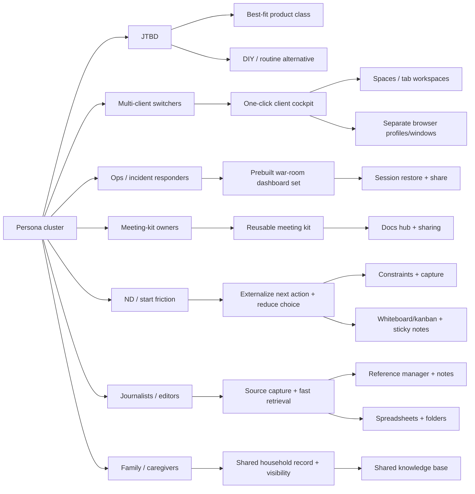

# Tabstax Competitors and JTBD Alternatives

## Executive summary

Tabstax positions itself as a “re-entry engine” for browser-centric work: save a project’s working context (tabs), attach explicit next actions, and relaunch the whole “project cockpit” on demand (plus optional cloud sync and sharing). Its core public surface is an extension + web app + CLI (“Hey!”), with a free tier (local Stax) and a Pro tier (€3.99/month) adding cloud sync, sharing/collaboration, and an “Attention Stax” priority board. citeturn4view0turn5view0turn5view1

The Tabstax use-case library explicitly targets *context-switching pain* across professional roles and personal-life admin, using “73 ways people use TabStax” as evidence. It also includes multiple neurodivergent personas (ADHD/ND) and frames the core failure mode as “reconstruction tax”: time/energy rehydrating context after switching. citeturn18view0turn19view1

The competitive set breaks into five “JTBD competitor” classes:

1. **Session/tab managers** that snapshot, restore, search, and sometimes sync sessions (e.g., OneTab, Session Buddy, Tabs Outliner, Tabli, TabXpert). citeturn27view0turn27view2turn30view0turn29search2turn31view1  
2. **Workspace tab managers** that try to become a project hub (e.g., Workona, Toby, Partizion) with “spaces/collections,” search, and team features. citeturn26view0turn26view2turn34view1  
3. **Browsers and native tab features** that offer tab groups/workspaces/spaces (Chrome tab groups; Vivaldi Workspaces; Arc Spaces). citeturn12search11turn12search3turn12search1  
4. **Adjacent “work OS / PKM” tools** that store decisions, notes, and project state but aren’t where the work *happens* (Notion, Obsidian, Roam). citeturn10search0turn37search2turn10search2  
5. **DIY, routines, and analog systems** that substitute for product features (bookmarking, multiple windows/profiles, whiteboards/kanban, “Bullet Journal,” GTD, PARA), widely reported in ADHD and journalism communities as coping workflows. citeturn12search11turn21search0turn21search1turn21search2turn16search9turn22search7turn17search0

**Distinctive wedge hypothesis (from a JTBD view):** many competitors solve “save/restore tabs,” fewer solve “restore tabs + restore intent (next action) + restore priority (what matters now) + restore shareable context for teams.” Tabstax’s public messaging explicitly bundles these layers (tabs + next actions + attention board + multi-surface capture). citeturn4view0turn5view0turn5view1

## Tabstax use-case audit

The Tabstax “Use Cases” index lists **73** scenarios split into **Work (6 categories)** and **Life (6 categories)**, deliberately mixing professional and personal “world switching.” citeturn18view0turn19view1

**Work categories (as published):** Multi-Client & Multi-Project; Ops, Incidents & Live Operations; Rituals, Meetings & Team Rhythms; Deep Work, Research & Analysis; SME & Multi-Role Founders; Legal & Crisis. citeturn18view0turn18view1turn19view0  
**Life categories (as published):** Admin, Money & Systems; Health, Recovery & Performance; Family, Care & School; Crisis, Loss & Legal Aftermath; Dreams, Second Act & Identity; Learning, Education & Future Self. citeturn19view1turn18view2turn19view2

### Extracted personas, workflows, and pain points

The table below captures every persona/use-case explicitly listed on the use-cases page, converting each scenario into a structured “workflow + pain point” record (and tagging neurodivergent personas where the page explicitly does so). citeturn18view0turn19view1turn19view2

| Domain | Category | Persona / use case (as listed) | Workflow snapshot (what they’re doing) | Primary pain points (implied/explicit) | ND explicit? |
|---|---|---|---|---|---|
| Work | Multi-Client & Multi-Project | Consultant With Three Clients and No Time | Finish work for Client A → jump to Zoom for Client B → need “ready-to-speak” context instantly | Rebuilding context, hunting links/docs, wrong tabs, arriving unprepared | — |
| Work | Multi-Client & Multi-Project | Neurodivergent Builder With 5 Parallel Projects | Runs multiple builds (product, book, experiments, client work) in parallel | High setup cost to re-enter; momentum loss; “starting from zero” feeling | Yes |
| Work | Multi-Client & Multi-Project | Sales Rep Chasing a Whale Account | Pre-call prep across CRM, proposal, competitor intel, call recordings, emails | Re-finding everything each interaction; scattered context | — |
| Work | Multi-Client & Multi-Project | Sales Engineer Prepping Two Different Demos in One Afternoon | Two demos with different audiences/angles | Tab/environment mix-ups; wrong demo surface | — |
| Work | Multi-Client & Multi-Project | Customer Success Manager Surfacing From One Renewal Into Another | QBR with healthy account → renewal-risk call | Switching posture and materials; tone bleed; missing prep artifacts | — |
| Work | Multi-Client & Multi-Project | Small Agency Founder With Three Clients Pulling at Once | Back-to-back client sessions (brand, landing page, crisis call) | Brand/context bleed; too many parallel toolsets | — |
| Work | Multi-Client & Multi-Project | Real Estate Agent on the Road Between Buyers and Sellers | Mobile-heavy day: viewings, valuation, negotiation | Phone browser chaos; lost listing context/maps | — |
| Work | Multi-Client & Multi-Project | Wedding Photographer Moving From Planning to Shooting to Editing | Phase-switching across planning → shoot → edit → delivery | Mode switching cost; scattered client assets | — |
| Work | Multi-Client & Multi-Project | Financial Planner Running Three Client Reviews in One Morning | Rapid client switching across very different financial situations | Rehydrating numbers/narrative/tone each time | — |
| Work | Multi-Client & Multi-Project | ADHD and the 40% Context Switching Tax | High-frequency task switching with amplified cost | Transitions are disproportionately expensive; work decay | Yes |
| Work | Multi-Client & Multi-Project | ADHD Remote Worker With Zero External Structure | Work-from-home with minimal external constraints | Formless days; inconsistent output; re-start friction | Yes |
| Work | Ops, Incidents & Live Operations | DevOps Responding to a Production Incident | Pager alert → open dashboards/logs/runbook/comms → coordinate | Minutes lost spinning up; link pasting; scattered cockpit | — |
| Work | Ops, Incidents & Live Operations | Emergency Manager Handling a Gas Leak With Multiple Agencies | Multi-agency incident requiring shared operational picture | Distributing links isn’t enough; need shared environment | — |
| Work | Ops, Incidents & Live Operations | DevOps Engineer Moving From Postmortem to Reliability Review | Move from retrospective analysis to forward-looking review | Toolset and emotional tone switch; context bleed | — |
| Work | Ops, Incidents & Live Operations | Emergency Manager Switching From Gas Leak to Storm Prep | Leave live incident → join planning call | Hard pivot from reactive to anticipatory; tool mismatch | — |
| Work | Ops, Incidents & Live Operations | Doctor in Clinic Moving From Checkups to a Scary Lab Result | Rapid patient context switching inside clinic workflow | Headspace switching; record/tool hunting under time pressure | — |
| Work | Ops, Incidents & Live Operations | Manufacturing Ops Manager Between Factory Floor, Supplier Crisis, and Audit | Three concurrent operational “cockpits” | Too many systems and stakeholders; fast switching | — |
| Work | Ops, Incidents & Live Operations | Festival Ops Lead Juggling Security, Weather, and Artist Schedules | Live ops across security + weather + schedule disruptions | Team shorthand needs shared context; high-stakes switching | — |
| Work | Ops, Incidents & Live Operations | Emergency Vet Switching From One Crisis to the Next | Multiple urgent cases + anxious owners | Carryover stress; need “clean attention” per case | — |
| Work | Ops, Incidents & Live Operations | Airline Operations Controller in a Storm | Manage diversions, duty limits, cascading delays | Complexity carried in tools; calm depends on cockpit | — |
| Work | Ops, Incidents & Live Operations | Construction Site Foreman Between Subcontractors, Deliveries, and Safety | Coordinate subs, deliveries, inspections | Multi-thread coordination with different success criteria | — |
| Work | Rituals, Meetings & Team Rhythms | Scrum Master With a Standup That Runs Without Them | Encode standup process as a reusable kit | Process depends on one person’s memory; drift when absent | — |
| Work | Rituals, Meetings & Team Rhythms | Corporate Manager Living in 12 SaaS Tools All Day | Calendar-driven day; constant context cuts | Meeting prep overhead; hunting notes/dashboards | — |
| Work | Rituals, Meetings & Team Rhythms | Product Manager With Three Streams and a 15-Minute Gap | Leave design crit → prep stakeholder review in 15 min | Re-entry in tiny window; missing “what matters” | — |
| Work | Rituals, Meetings & Team Rhythms | Corporate Manager With Back-to-Back Different-Universe Meetings | Delivery sync → strategy → HR calibration | Role hat changes; appearing prepared requires fast re-entry | — |
| Work | Rituals, Meetings & Team Rhythms | Teacher Running Back-to-Back Classes and a Parent Meeting | Class-to-class switching + parent meeting | Student record hunting; emotional tone shifts | — |
| Work | Rituals, Meetings & Team Rhythms | Conference Organizer Switching Between Sponsors, Speakers, and Venue | Parallel tracks: contracts/logos → speaker logistics → venue ops | Browser becomes junkyard; track mixing | — |
| Work | Rituals, Meetings & Team Rhythms | Recruiter Running a Full Interview Loop for One Candidate | ATS + CV + GitHub + feedback + emails across panel | Shared candidate context needed; scattered artifacts | — |
| Work | Rituals, Meetings & Team Rhythms | “Don’t Update Me” — But My ADHD Brain Needs That | Work without intermediate check-ins | Tasks drift; lack of external structure | Yes |
| Work | Rituals, Meetings & Team Rhythms | Journalist Managing a Multi-Contributor Article With Runners and Editors | Lead writer coordinating runner docs, photos, CMS, editor comms | Tab explosion; version blur; tracking status under deadline | — |
| Work | Deep Work, Research & Analysis | Data Analyst With Three Urgent Requests From Different Execs | Treat each exec question as a different narrative + dataset | Context bleed; time-boxing breaks; reorient cost | — |
| Work | Deep Work, Research & Analysis | UX Researcher Jumping Between Live Sessions and Synthesis | Prototype/script sessions → affinity/synthesis/report | Mode switching; keeping artifacts separated | — |
| Work | Deep Work, Research & Analysis | NGO Program Manager Between Field Updates and Donor Reports | Field reality → polished donor reporting | Tone formatting mismatch; artifact switching | — |
| Work | Deep Work, Research & Analysis | Film Editor Cutting a Feature and a Trailer for Different Clients | Same tools, different client worlds | Tool overlap but world separation required | — |
| Work | Deep Work, Research & Analysis | Investment Analyst Covering Three Sectors on Earnings Week | Multiple coverage universes with different KPIs/comps | Too much to carry in working memory; separate universes | — |
| Work | Deep Work, Research & Analysis | City Planner Balancing Transport Corridor, Housing Project, and Public Input | GIS + models + submissions across political contexts | Keeping environments separate; avoiding cross-contamination | — |
| Work | Deep Work, Research & Analysis | Penetration Tester Handling Two Engagements Plus Reporting | Multi-client security work + reporting | Credential/URL mix-up risk; strict separation | — |
| Work | Deep Work, Research & Analysis | ADHD Task Initiation: Staring at the Screen, Unable to Start | Knows task but can’t begin; opens irrelevant tabs | Missing start signal; re-entry friction; decision fog | Yes |
| Work | Deep Work, Research & Analysis | ADHD Decision Paralysis: Frozen by Too Many Options | Many tasks feel equally urgent | Can’t rank; starts none; guilt spiral | Yes |
| Work | SME & Multi-Role Founders | SME Owner Running the Business From 6 Different Apps | Daily rebuild of “ops view” across invoicing, bank, PM, etc. | Orientation cost; tool fragmentation | — |
| Work | SME & Multi-Role Founders | Startup Founder Doing Board Prep Between Fires | Deck + prod bug + pricing + hiring | Browser becomes “junk drawer”; no separation | — |
| Work | SME & Multi-Role Founders | Marketing Lead Orchestrating a Launch Across Channels | Landing/email/social/ads/PR launch orchestration | Tab graveyard; half-remembered context | — |
| Work | SME & Multi-Role Founders | Solo Developer Pinballing Between Code, Bugs, and Launch | Fix bug → ship UI → support → launch prep | Each needs different “canvas”; ping-pong switching | — |
| Work | SME & Multi-Role Founders | YouTuber / Streamer Jumping Between Prep, Live, and Post | Prep → live → edit → schedule | Tool/headspace mismatch; mode chaos | — |
| Work | SME & Multi-Role Founders | Remote Founder Doing Investor Pitch, Hiring Interview, and Roadmap Review | Same product, different “rooms” (investors, candidate, internal) | Narrative switching; staying grounded requires separation | — |
| Work | SME & Multi-Role Founders | Veterinary Clinic Owner Balancing Patients, Staff, and Business | Vet role → HR rota → finance/marketing | Wearing “one hat at a time” challenge | — |
| Work | SME & Multi-Role Founders | Bootstrapping Founder Anne Building an App, One Customer at a Time | Per-prospect workspace with notes/next actions | Customer-by-customer workflow; pipeline visibility | — |
| Work | SME & Multi-Role Founders | ADHD Freelancer Who Misses Every Deadline | Freelancing without external structure | Deadlines slip; client drift; shame loop | Yes |
| Work | Legal & Crisis | Public Defender in LA, 100 Degrees, Court in 10 Minutes | Multi-case scramble under time pressure | Buried emails/docs; environment must remember | — |
| Work | Legal & Crisis | Hospital Social Worker Handling Three Complex Discharges | Multiple discharges across portals/docs | Maze of portals/PDFs; cognitive burden | — |
| Work | Legal & Crisis | HR Generalist Dealing With a Grievance, an Offer, and a Policy Rollout | Sensitive grievance → offer letter → policy changes | Emotional tone bleed; doc sensitivity | — |
| Work | Legal & Crisis | Policy Lobbyist Prepping Lawmakers for a Committee Hearing | Tailored briefing packs per lawmaker/staffer | Parallel “packs”; need shareable environments | — |
| Work | Legal & Crisis | Professor Running for State Senator Under Fire | Campaign + opposition + media + volunteers/life | Multiple roles; high-stakes switching | — |
| Life | Admin, Money & Systems | Personal Finances & Taxes With an Accountant in the Loop | Tax portal + bank + receipts + coordination | Re-opening everything; collaboration over email | — |
| Life | Admin, Money & Systems | Person Planning a Big Move to Another Country | Visa + housing + jobs + language + cancellations | “Starting again” every session; scattered planning | — |
| Life | Admin, Money & Systems | Fired Again: ADHD and the New Job Onboarding Cliff | Onboarding into new systems/people without routine | Executive-function collapse framed as re-entry failure | Yes |
| Life | Health, Recovery & Performance | Bill, 240lbs, Training for His First Marathon | Training plans + gear + nutrition research | Re-googling; turning goal into a continuing project | — |
| Life | Health, Recovery & Performance | Recently Sober Person Balancing Recovery, Work, and Rebuilding | Three fragile layers; open “Recovery” workspace when wobbly | Need low-friction next steps; minimal choice | — |
| Life | Health, Recovery & Performance | The Procrastinator Who Keeps Saying “It’s Fine” | Multiple ignored alarms (money, renewal, side project) | Quiet alarms dismissed; needs named container | — |
| Life | Health, Recovery & Performance | Preparing for Surgery in 4 Weeks | Pre-op, insurance, handover, recovery logistics | 3am logistics spirals; shared visibility needed | — |
| Life | Health, Recovery & Performance | ADHD Tab Hoarder Using the Browser as an External Brain | Hundreds of tabs as memory placeholders | Clutter collapse; can’t find anything; browser slows | Yes |
| Life | Health, Recovery & Performance | ADHD Time Blindness: Where Did the Entire Day Go? | “Worked all day” but can’t name outcomes | Lack of visible progress; day invisibility | Yes |
| Life | Health, Recovery & Performance | The ADHD Medication Cliff (afternoon focus drop) | Afternoon productivity drop described (page references medication) | Midday “second shift” failure mode; re-entry support | Yes (medical ref present; details omitted) |
| Life | Health, Recovery & Performance | ADHD Productivity App Fatigue: Tried 36 Apps, Still Losing Tabs | Cycles through productivity apps; none manages browser reality | Tool churn; browser remains unmanaged work surface | Yes |
| Life | Family, Care & School | ND Parent With School Chaos and Shared Mental Load | School portals + payments + calendars shared between parents | One parent carries load; needs shared workspace | Yes |
| Life | Family, Care & School | Parent Planning a Multi-Country Trip With Their Partner | Flights/trains/stays/ideas/budget across many tabs | “Forty tabs of maybe”; losing the good find | — |
| Life | Family, Care & School | Mum With a Son Who Has Special Needs — The Call From the School | Need IEP/emails/benefits/past agreements quickly | “Full record now” under stress; retrieval tax | — |
| Life | Family, Care & School | Caregiver for an Ageing Parent | Portals + legal docs + providers + sibling comms | Constant retrieval; multi-system coordination | — |
| Life | Crisis, Loss & Legal Aftermath | Funeral Planning While Grieving | Funeral home + burial + obituary + relatives | Admin cruelty layered on grief; low energy | — |
| Life | Crisis, Loss & Legal Aftermath | Executor Handling Estate and Paperwork After a Death | Probate + accounts + utilities + sale | Long-running admin project; episodic sessions | — |
| Life | Dreams, Second Act & Identity | Dungeon Master Running Multiple Campaigns | Separate worlds: maps, NPCs, plots, backstories | Keeping worlds distinct; fast recall builds trust | — |
| Life | Dreams, Second Act & Identity | Genealogy Hobbyist Piecing Together a Family Line | Census/parish/passenger/DNA research | Tab explosion; identity confusion across similar names | — |
| Life | Dreams, Second Act & Identity | Community Organizer Leading a Tenant Group | Shared “Read First” resource hub for new helpers | Onboarding helpers; avoiding repeated info dumps | — |
| Life | Dreams, Second Act & Identity | Artist Turning a Hobby Into a Small Online Shop | Platform/pricing/payment/shipping/promo | “What’s next?” fades; scattered steps | — |
| Life | Dreams, Second Act & Identity | Retiree Starting a Second Act | Pension/insurance/roles/travel/course | Nothing moves because it’s in head + tabs | — |
| Life | Dreams, Second Act & Identity | Midlife “Quiet Crisis” | Relationship + work + creative dream | Alarms anesthetized; needs container to evolve | — |
| Life | Dreams, Second Act & Identity | Ger: Feeding His Family From the Back Garden in Two Years | Long horizon plan across seasons | Seasons pass without plan; needs cockpit | — |
| Life | Dreams, Second Act & Identity | Mary, Who Acted 20 Years Ago and Buried It | Re-awakening a serious creative project | Treat dream as project, not fantasy | — |
| Life | Dreams, Second Act & Identity | Climate-Anxious Engineer Building a Local Resilience Project | Community solar/tool libraries/food co-ops research | Anxiety-to-project containerization | — |
| Life | Dreams, Second Act & Identity | Nurse on Night Shifts, Secretly Writing a Novel | Irregular schedule; writing project re-entry | Draft avoidance; turning wish into habit | — |
| Life | Dreams, Second Act & Identity | The ADHD Project Graveyard: 20 Starts, Zero Finishes | Many starts; none finish past initial motivation | Dopamine crash cycle; re-entry and continuity failure | Yes |
| Life | Learning, Education & Future Self | University Lecturer Split Between Teaching, Research, and Admin | Switch between teaching/admin/research | Separate mental spaces; minimizing form fatigue | — |
| Life | Learning, Education & Future Self | Anne, Laid Off, on a Weekly Accountability Call With Friends | Weekly accountability anchored in “next action moved” | Vague commitments → concrete action tracking | — |
| Life | Learning, Education & Future Self | Young Adult Balancing Uni, Side Hustle, and Family Expectations | Coursework + freelancing + family pressure | Uncontrolled switching; distraction via “escape tabs” | — |
| Life | Learning, Education & Future Self | Youth Trying to Get Into College — Applications, Essays, Panic | Applications + essays + research tabs | Overwhelm; amorphous “college stuff” | — |
| Life | Learning, Education & Future Self | Failing Student Overwhelmed and Quietly Drowning | LMS red labels; avoidance | Shame → avoidance; needs smallest next step | — |
| Life | Learning, Education & Future Self | ADHD Student Staring at a Blank Assignment for Three Hours | Essay due; “tabs multiplied” | Can’t find key sources; overload | Yes |

### JTBD themes implied by the use-case library

Across the 73 scenarios, Tabstax is implicitly competing for a consistent set of jobs (JTBD), regardless of persona:

- **Re-enter a project instantly** without hunting tabs, links, docs, dashboards. citeturn4view0turn18view0  
- **Prevent context bleed** between “worlds” (clients, roles, cases, campaigns, life domains). citeturn18view0turn19view0  
- **Make the next action explicit** so re-entry becomes execution (not re-planning). citeturn4view0turn5view0  
- **Coordinate via shareable context** (teams, contributors, incident responders, family). citeturn5view0turn20view0turn20view3  
- **Turn tabs into a structured external memory** without letting the tab pile collapse. citeturn19view1turn20view2  

## Competitive landscape

### How competitors cluster against Tabstax

A rigorous competitor catalog starts by recognizing that “too many tabs” is not a single market. Different tools solve different slices:

- **Session capture & restoration** (fast “save/restore,” crash safety, memory reduction). citeturn27view0turn27view2turn23search3turn30view0  
- **Workspace separation** (spaces, collections, work/personal segmentation, “only show me the current project’s tabs”). citeturn26view0turn26view2turn12search3turn12search1  
- **Search and retrieval** across open tabs + saved sessions. citeturn26view0turn31view1turn27view2  
- **Notes/tasks embedded in tab management** (tab-linked to-dos, annotations, checklists). citeturn26view2turn30view0turn4view0  
- **Team handoff / shared workspaces** (collaboration, SSO/admin on paid tiers). citeturn26view1turn26view2turn4view0  
- **Adjacent systems** (Notion/Obsidian/Roam etc.) that do not manage tabs directly but absorb research state and decisions. citeturn10search0turn37search2turn10search2  

### Competitor catalog

The products below are grouped by “what job they primarily do.” Each row includes features, pricing, collaboration, integrations, strengths/weaknesses, and likely target personas.

**Key:** pricing reflects public pages at time of research (Feb 20, 2026). Where pricing is not reliably visible, it is labeled as such.

| Product | Category | Core features | Pricing tiers | Collaboration | Integrations | Strengths | Weaknesses | Target personas (best fit) | Key sources |
|---|---|---|---|---|---|---|---|---|---|
| entity["company","TabStax","tab context + next actions"] | Re-entry system (tabs + intent) | Save/open Stax (tabs as project state); “Start Page” next actions; Attention Stax priority board; Focus Mode; share Stax; CLI capture (“Hey!”) | Free (€0) local; Pro €3.99/mo with sync + sharing + Attention Stax | Yes (Pro) | CLI + extension + web app (multi-surface capture) | Bundles “context + next action + priority”; explicit positioning around re-entry | Less proven ecosystem vs incumbents; browser-extension trust/friction | Multi-project operators; ND builders; meeting-heavy roles; journalists; caregivers | citeturn4view0turn5view0turn5view1turn18view0 |
| entity["company","OneTab","tab list saver"] | Session “dump to list” | Convert tabs → list; restore one/all; export/import; optional “share as web page”; privacy emphasis; memory reduction claims | Free | Limited (share via web page list) | Minimal | Extremely simple; huge install base; fast memory relief | Not a workspace system; weak on “next action,” prioritization, team work; risk of losing data if mishandled | Tab hoarders; students; casual researchers | citeturn27view0turn27view1 |
| entity["company","Session Buddy","tab & bookmark manager"] | Session manager | Save open tabs as collections; restore later; crash recovery; search collections; manages tabs/bookmarks | Free (donation-supported positioning) | No native team spaces | Limited | Strong “crash recovery + collections”; widely used | “Intent” layer is thin (no real project plan); sharing limited; extension privacy surface can be sensitive | Power browser users; researchers; ops/devs wanting recovery | citeturn27view2turn27view3 |
| entity["company","Toby","tab collections + team"] | Workspace tab hub | Organize tabs into collections; save/restore sessions; search; dedup; “Next” and built-in to-do for tabs (as advertised); invite/share; SSO on team plan | Free starter (60 saved tabs); paid Productivity + Team | Yes (invite/share; team plan adds admin/SSO) | Promotes integrations (and “AI tools” marketing) | Strong collaborative angle vs purely local extensions; search/dedup on paid tiers | Can become another “system to maintain”; limits on free plan; center-of-gravity may be “collections,” not execution | Teams; sales; CS; agencies; journalists coordinating links | citeturn26view2turn6search1turn6search9 |
| entity["company","Workona","spaces tab manager"] | Workspace tab manager + integrations | “Spaces” per project; autosave sessions; cloud backups; sync across devices; tab suspension; universal search | Free exists; Pro/Team/Enterprise tiers (SSO/admin on Enterprise) | Yes (Team/Enterprise: shared spaces, real-time collab, admin/SSO) | Emphasizes cloud-app integrations (Drive, Slack, task app integrations) | Deep “project spaces” concept; mature for teams; enterprise governance options | Heavier product; more “workspace OS” than lightweight extension; may be overkill for personal use | Multi-project knowledge workers; client teams; ops + PM-heavy orgs | citeturn26view0turn26view1turn6search11 |
| entity["company","Tabli","local tab overview"] | Tab navigator / window manager | Searchable overview of windows/tabs; fast switching; save/restore windows; runs locally; no outbound connections (per listing) | Free | No | Minimal | Lightweight, privacy-forward posture; great “where is that tab?” tool | Not a full “workspace” layer; limited collaboration; depends on Chrome | Multi-window users; engineers; analysts juggling many windows | citeturn29search2turn7search4turn7search0 |
| entity["company","Tabs Outliner","tree session manager"] | Session manager + annotations | Tree overview of open/saved tabs; annotate tabs/windows; to-do items; close-save in place; crash restoration; export lists; optional paid backups incl. Google Drive | Free core; optional one-time paid features (price varies by region, per vendor community) | Limited (export/share; not true shared workspaces) | Mentions exports to Google Doc/Word/Evernote/email | Rich “browsing notebook” model; closest to “tab + notes” among classic extensions | UX can be heavy; pricing not transparent; Chrome store update cadence varies | Researchers; writers; ADHD tab-overload users wanting structure | citeturn30view0turn29search3turn29search13 |
| entity["company","TabXpert","auto-saved sessions + tags"] | Advanced session & tab manager | Auto-saved sessions; tab group management; optional cloud sync; tags; search across sessions/tabs/bookmarks; local-first + optional cloud; multiple UI modes; importers | Paid plan exists; also “free Ads plan” mentioned; exact pricing not reliably visible via accessible pricing page | Some sharing (bookmarks) | Integrates with suspenders; mentions third-party services for payments/analytics | Technically deep; power-user features (tags/search/version history) | Pricing opacity; may be complex; “ads plan” tradeoff; explicitly not focused on Firefox | Power users; devs; analysts; people needing versioned sessions | citeturn31view1turn33view0turn8search5 |
| entity["company","Partizion","tab collections + workspaces"] | Workspace session manager | Workspaces + collections; auto-updating collections; cloud sessions; search; positions against “mixed up work” | Paid plans (trial → monthly); also “beta pricing” messaging | Not clearly positioned as collaborative spaces (primarily personal) | Limited | Strong “collections as tasks/projects/reading lists” framing | Pricing higher than many extensions; unclear team workflow depth | Personal power users; people wanting “bookmarking reinvented” | citeturn34view1turn34view0turn8search9 |
| entity["company","Vivaldi","browser with workspaces"] | Browser-native workspace approach | Workspaces separate tab sets; Tab Stacks; show only tabs for current workspace | Free (browser) | N/A (browser-level; sharing via links) | N/A | “Workspaces” is a built-in version of project separation | Doesn’t inherently attach “next actions” or team handoff state | People willing to switch browsers; multi-context operators | citeturn12search3turn12search9turn12search17 |
| entity["company","Arc","spaces browser"] | Tab-first browser UX | Spaces as distinct browsing areas; pinned/unpinned sections per Space | Free (browser) | Light sharing patterns; not core “shared spaces” | N/A | Strong context separation UX | Strategic uncertainty: Arc reportedly stopped new feature development (security/bug fixes continue); ecosystem shifting to Dia | Early adopters; creators; people who live in browser-sidebars | citeturn12search1turn35search0turn35search4 |
| entity["company","Dia","ai browser"] | AI-first browser | “Chat with your tabs” positioning; AI-integrated workflows | Free beta/availability varies | TBD | AI-centric | Potential future competitor for “re-entry” if tab+AI becomes project cockpit | New category risk; unknown enterprise/workflow outcomes | Early adopters; knowledge workers wanting AI-native browsing | citeturn35search14turn35news43turn36search0 |
| entity["company","Atlassian","collaboration software company"] | Platform owner (browser adjacencies) | Owns/operates multiple work tools; acquired The Browser Company (Arc/Dia) | N/A | N/A | N/A | Could drive “browser as work surface” convergence | Not a tab manager itself, but shapes ecosystem direction | Enterprise teams (indirect competitor via portfolio) | citeturn36search0turn11search2 |
| entity["company","Notion","collaborative workspace app"] | PKM / work OS | Docs + wiki + projects; integrations directory; collaboration substates | Free/Plus/Business/Enterprise | Yes | Many integrations (Jira, Drive, Slack, etc.) | Strong shared knowledge base; replaces many docs/tools | Not tab/session state; re-entry still requires re-opening working surfaces | Teams; founders; journalists managing editorial ops | citeturn10search0turn37search1turn37search0 |
| entity["company","Obsidian","local notes app"] | Local-first PKM | Local markdown vaults; optional Sync (E2E encryption, version history, shared vault collab per pricing page); optional Publish | Core app free; Sync add-on; Publish add-on | Possible via shared vaults (Sync) | Integrations via plugins/ecosystem; not native “apps” | Strong for personal knowledge; offline/local control | Not tab restoration; collaboration requires paid add-ons and shared workflows | Writers/researchers who want durable notes more than tab state | citeturn37search2turn37search6turn10search22 |
| entity["company","Roam Research","networked note-taking"] | Networked notes | Graph/networked thought; paid subscription posture | Believer / annual plan signals on homepage snippet (site not fully crawlable here) | Yes (shared graphs) | Limited | Strong daily-note + backlink workflows | Not a tab manager; subscription cost; depends on web app | Writers, researchers, journalists doing synthesis | citeturn10search2 |
| entity["company","Zotero","reference manager"] | Research capture | Collect/organize/annotate/cite/share research; browser connector saves metadata; group libraries; storage tiers | Free core + paid storage tiers | Yes (groups) | Browser connectors; citations | Best-in-class for sources, PDFs, citations; journalist-friendly | Not a “working cockpit” of tabs; more archival | Journalists/researchers managing sources and attribution | citeturn25search1turn25search0turn25search4 |
| entity["company","Raindrop.io","bookmark manager"] | Bookmarking/read-later hybrid | Bookmarks + collections; Pro adds full-text search and permanent copies; collaboration allowed even without paying (per FAQ) | Free + Pro | Yes | Multiple platforms/extensions | Strong for long-term library; cross-device; sharing | Not session state; lacks “open all tabs exactly as was” | Researchers; journalists; “save it forever” users | citeturn14search3turn14search11 |
| entity["company","Instapaper","read-it-later app"] | Read-it-later | Premium adds full-text search, PDF support, permanent archive, unlimited notes | Premium monthly/annual | Limited sharing | E-reader integrations vary; Pocket migration program exists | Strong reading pipeline (best when the “job” is reading) | Not a workspace for active production; tab context not preserved | Journalists; researchers; readers with large backlog | citeturn14search1turn14search5turn15search8 |
| entity["company","Readwise","reader + highlights app"] | Reading + resurfacing | Reader + Readwise highlights; export to tools (Notion/Obsidian etc. listed) | Subscription pricing | Limited | Exports to Notion/Obsidian and more | Strong “reading → highlight → resurface” loop | Not tab context switching; more “knowledge ingestion” than execution | Writers/researchers; journalists building source libraries | citeturn14search6turn14search2 |
| entity["company","Pocket","read-it-later service"] | Read-it-later (discontinued) | Service shut down July 8, 2025; export window described by Mozilla | Shut down | N/A | N/A | Important “replacement moment” for audiences migrating | Not available | Former Pocket users migrating to alternatives | citeturn15search0turn15search10turn15search1 |
| entity["company","Google Chrome","web browser"] | Browser-native | Tab groups and management; can show tab groups in bookmarks bar and auto-pin groups (help doc) | Free | N/A | N/A | Zero friction; built-in + stable | No “next action” or shareable cockpit; limited cross-app workspace semantics | Mass-market baseline competitor | citeturn12search11turn24search16 |
| entity["company","Microsoft Edge","web browser"] | Browser-native + AI | Collections historically organized web content, but multiple reports in Jan 2026 indicate Collections retirement prompts and export/move options | Free | N/A | Microsoft ecosystem | If Collections is removed, users will need replacements | Feature churn risk; uncertain continuity | Enterprise users; Microsoft shops | citeturn13search3turn13search8turn13search7 |
| entity["company","Tree Style Tab","firefox extension"] | Tree navigation | Tabs as collapsible trees in sidebar; drag/drop restructure | Free | N/A | N/A | Excellent for “tab overload” without leaving browser | Mostly improves navigation, not project state sharing | Firefox power users; researchers | citeturn23search0turn23search11 |
| entity["company","Sidebery","firefox extension"] | Sidebar tabs + groups | Vertical tabs tree + grouping + advanced containers config | Free | N/A | N/A | Powerful “organize in sidebar” toolkit | Complexity; stability complaints exist in community threads | Firefox power users | citeturn23search1turn23search15 |
| entity["company","Tab Session Manager","browser extension"] | Session manager (cross-browser) | Save/restore states; autosave; cloud sync (per Firefox listing) | Free | Limited | N/A | Strong crash/session management; tags | Thin “intent” layer; sharing not core | Users who fear losing tabs; multi-device users | citeturn23search3turn23search13 |
| entity["company","Auto Tab Discard","tab suspender extension"] | Performance tool | Discards inactive tabs to reduce memory; uses native discarding API (per listing) | Free | N/A | N/A | Solves “browser is slow” without reorganizing everything | Doesn’t solve “where was I?” or project state | Tab hoarders; laptop users | citeturn24search1turn24search16 |
| entity["company","Tab Wrangler","auto-close idle tabs"] | Tab reduction routine | Auto-closes idle tabs; keeps list to reopen; “Tab Corral” | Free | N/A | N/A | Enforces hygiene automatically | Can feel punitive; doesn’t preserve deep context | People needing forced constraints | citeturn24search2turn24search5 |
| entity["company","The Great Suspender","chrome extension"] | Legacy tab suspension (cautionary) | Popular suspender removed for malware; Google proactively disabled | Removed | N/A | N/A | Teaches trust lesson for extension ecosystems | Unsafe legacy; not a viable option | Mentioned as risk/lesson, not recommendation | citeturn24search3turn24search10turn24search6 |
| entity["company","Cluster","window & tab manager extension"] | Legacy window/tab manager | Previously saved windows/tabs; reports indicate removal tied to extension platform changes | Historically free + paid sync license; now reportedly removed from store | Limited | N/A | Many users relied on it as a window/tab manager | Discontinuation risk; migration event for users | Former Cluster users seeking replacement | citeturn29search1turn8search10turn8search4 |
| entity["company","Trello","kanban tool"] | Project/collaboration | Boards/cards; pricing tiers; broad adoption | Free + paid tiers | Yes | Power-ups/integrations | Good for visible workflow; lightweight PM | Doesn’t restore browser context; can become “yet another tool” | Teams; founders; personal kanban users | citeturn11search0turn11search12 |
| entity["company","Asana","project management software"] | Project/collaboration | Task/project tracking; pricing tiers | Free + paid tiers | Yes | Many | Strong for structured PM | Doesn’t solve tab re-entry; tool overhead | Editors/PMs; newsroom ops | citeturn11search1turn11search5 |
| entity["company","Slack","collaboration platform"] | Comms/work hub | Channels + messaging + integrations; pricing tiers | Free + paid tiers | Yes | Many | Central coordination surface | Not tab context; threads bury links | Teams; newsrooms; incident response | citeturn11search3turn11search7 |

## JTBD competitors beyond products

### Evidence base: why “tab overload” is a real problem (not just preference)

Research and institutional guidance consistently support the idea that switching tasks has measurable costs and that modern browsing patterns overload tabs with multiple roles (memory, reminders, research, multitasking):

- The entity["organization","American Psychological Association","apa"] explains “switching costs” in multitasking research as measurable time costs when shifting attention between tasks. citeturn28search0  
- Classic interruption research (e.g., work by Gloria Mark and colleagues) studies “reorientation” time after interruptions as a real productivity/stress factor. citeturn28search22  
- “Cognitive offloading” research defines the practice of using the environment to reduce internal cognitive demand—relevant to tabs used as external working memory. citeturn28search2turn28search9  
- HCI research on browser tabs (Joseph Chee Chang and colleagues) explicitly investigates “tab overload” and why tabs become overloaded with mixed functions. citeturn28search3turn28search6  

These sources support a disciplined JTBD statement: **people use tabs as a multi-purpose external cognition layer, then pay a tax when that layer becomes too large, too ambiguous, or too fragmented.** citeturn28search2turn28search6

### DIY and self-help routines used in real life (with community examples)

The strongest JTBD competitors to Tabstax are often not “apps,” but *behaviors*. In ADHD communities, “tab hoarding” is widely described and routinely managed via ad-hoc tools and hard constraints:

> “...mostly to accommodate the ~200 browser tabs I'll have open...” citeturn16search0  

> “I am also a tab hoarder. I recommend using one tab!” citeturn16search1  

> “Bookmark all function in browser... name them in folders and organize...” citeturn16search9  

From these threads (and many like them), you see recurring DIY patterns:

**Browser-native “batch save”**  
People use built-in methods like “Bookmark All Tabs” or tab groups to create a crude form of sessions (often as folders) and return later. citeturn16search9turn12search11

**Hard constraints as automation**  
Some adopt “tab limiters” or “auto-close idle tabs” so the system forces cleanliness (a different job than “project re-entry,” but competes for the same attention). citeturn24search2turn16search0

**Analog “external brain” substitutes**  
Whiteboards, sticky notes, and physical kanban boards substitute for “next action + priority visibility” because they are high-salience and low-friction.

> “You can make a physical [kanban] one on a whiteboard...” citeturn22search7  

> “My favourite... sticky notes in weird but obvious places...” citeturn22search9  

**Structured self-help systems**  
- GTD formalizes capture/clarify/organize/reflect/engage and explicitly demands externalizing “what has your attention.” citeturn21search0  
- Bullet Journal method emphasizes rapid logging and flexible notation (often attractive as “external brain on paper”). citeturn21search1  
- PARA is used as a cross-tool organizational scheme (Projects/Areas/Resources/Archives). citeturn21search2  

These are JTBD competitors because they reduce the same “reconstruction” and “what do I do next?” friction—just via different mediums.

### Journalist workflows as JTBD competitors

Journalists often describe tab overload as normal, and they compensate with tools designed for sources, not tabs:

> “...working on several stories because you need at least 20 or more tabs open...” citeturn16search2  

In organization threads, reporters recommend tools like Zotero as a “research manager”:

> “I love using Zotero... It’s free and open source.” citeturn17search0turn25search1  

Zotero’s official documentation emphasizes browser connectors for metadata-rich saving into a library, which is a different job than tab session restore but competes directly for the “save sources + retrieve later” portion of tab usage. citeturn25search0turn25search6

## Comparative analysis tables and suggested visuals

### Feature comparison of top products

Top products were selected by relevance to “tab/workspace state management + re-entry,” with a few adjacent “state organizers” (Notion/Obsidian) included because they frequently substitute for the “project cockpit” job.

| Product | Save/restore tabs | Cross-device sync | Notes / next actions | Priority / focus view | Sharing / collaboration | Search across saved state | Best at (primary JTBD) |
|---|---|---|---|---|---|---|---|
| Tabstax | Yes (Stax) citeturn4view0turn5view0 | Yes (Pro) citeturn4view0 | Yes (“next actions,” Start Page) citeturn4view0turn5view0 | Yes (Attention Stax, Focus Mode) citeturn4view0 | Yes (Pro) citeturn4view0turn5view0 | Implicit via dashboard + project list | Re-entry: restore context + intent citeturn4view0 |
| Workona | Yes (spaces autosave) citeturn26view0 | Yes citeturn26view0 | Yes (docs/links sections implied) citeturn26view1 | Partial (spaces separation) citeturn26view0 | Yes (Team/Enterprise) citeturn26view1 | Yes (universal search) citeturn26view0 | Project spaces + integrations |
| Toby | Yes (save sessions) citeturn26view2 | Implied (team/cloud product) | Yes (“Next” + built-in to-do) citeturn26view2 | Partial (collection-centric) | Yes (invite/share, SSO on team) citeturn26view2 | Yes (advanced search on paid) citeturn26view2 | Team link hub + tab collections |
| OneTab | Yes (tab list restore) citeturn27view0 | No (unless via manual export/share page) citeturn27view0 | No | No | Limited (share as webpage) citeturn27view0 | Limited | Memory relief + “dump tabs to list” |
| Session Buddy | Yes (collections) citeturn27view2 | Not core | No | No | No | Yes (search collections) citeturn27view2 | Crash recovery + collections |
| TabXpert | Yes (auto-saved sessions) citeturn31view1turn33view0 | Optional cloud sync citeturn31view1turn33view0 | Partial (metadata/tags vs next actions) | No | Limited | Yes (search across sessions/tabs/bookmarks) citeturn31view1turn33view0 | Power-user session/version management |
| Tabs Outliner | Yes (tree restore) citeturn30view0 | Optional backups (Drive mentioned) citeturn30view0 | Yes (notes + to-do items) citeturn30view0 | Partial (tree hierarchy supports focus) | Limited (export/share) citeturn30view0 | Limited | “Browsing notebook” |
| Tabli | Partial (save/restore windows) citeturn29search2 | No | No | No | No | Yes (find/switch tabs) citeturn7search12 | Fast tab/window navigation |
| Arc | “Spaces” separate contexts citeturn12search1 | Sync depends on browser account | No | Partial (space-based flow) citeturn12search1 | Not core | Sidebar helps retrieval | Context separation at browser UX layer citeturn12search1turn35search0 |
| Vivaldi | Workspaces + tab stacks citeturn12search3turn12search17 | Via browser sync | No | Partial (workspace isolation) citeturn12search3 | Not core | Browser-level | Built-in tab workspace separation |
| Notion | No | Yes | Yes | Yes (views/databases) | Yes | Yes | Durable shared project knowledge citeturn37search0turn37search1turn10search0 |
| Obsidian | No | Optional Sync (E2E, shared vaults) citeturn37search2 | Yes (notes), partial tasks via plugins | No | Possible via shared vaults (Sync) citeturn37search2 | Yes (local search) | Local-first knowledge base citeturn37search2turn10search22 |

### Use-case archetypes vs products: fit/coverage matrix

This matrix compresses the 73 scenarios into archetypes that represent the “job underneath” and scores each product’s coverage: **Strong (●), Partial (◐), Weak/none (—)**. Scoring is an analytic assessment derived from the documented feature sets above (not vendor-claimed “best” statements). citeturn4view0turn26view0turn26view2turn27view0turn30view0turn12search3turn12search1turn37search0turn37search2turn25search1

| Use-case archetype | Tabstax | Workona | Toby | OneTab | Session Buddy | TabXpert | Tabs Outliner | Arc | Vivaldi | Notion | Obsidian | Zotero |
|---|---:|---:|---:|---:|---:|---:|---:|---:|---:|---:|---:|---:|
| Rapid re-entry to exact working tabs | ● | ● | ● | ● | ● | ● | ● | ◐ | ◐ | — | — | — |
| Attach “next action” to re-entry | ● | ◐ | ● | — | — | — | ◐ | — | — | ● | ◐ | — |
| Multi-role / multi-client context separation | ● | ● | ● | ◐ | ◐ | ● | ● | ● | ● | ◐ | ◐ | — |
| Team/shared cockpit handoff | ● | ● | ● | — | — | — | — | — | — | ● | ◐ | ● |
| Incident/war-room preparedness (prebuilt cockpit) | ● | ● | ◐ | ◐ | ● | ● | ● | ◐ | ◐ | ◐ | — | — |
| Journalist multi-source + contributor workflow | ● | ● | ● | ◐ | ◐ | ◐ | ● | ◐ | ◐ | ● | ● | ● |
| “Tab hoarder” cleanup without losing memory | ● | ● | ● | ● | ● | ● | ● | ◐ | ◐ | ◐ | ◐ | — |
| Personal-life admin projects (tax/move/care) | ● | ● | ● | ◐ | ◐ | ◐ | ◐ | ◐ | ◐ | ● | ● | — |
| Long-horizon “second act” projects | ● | ◐ | ◐ | — | — | — | ◐ | ◐ | ◐ | ● | ● | — |
| Deep research library + citation management | ◐ | ◐ | — | — | — | — | — | — | — | ◐ | ◐ | ● |

### Persona profiles with needs and product matches

This table clusters Tabstax’s 73 personas into practical segment profiles, then suggests strongest alternatives per segment (including JTBD substitutes).

| Persona cluster | Core needs (JTBD) | Likely strongest non-Tabstax matches | Why those matches fit |
|---|---|---|---|
| Multi-client switchers (consultants, agencies, planners, recruiters) | One-click “client cockpit”; avoid cross-client bleed; quick meeting prep | Workona, Toby, browser workspaces (Arc/Vivaldi), Tabs Outliner | Spaces/collections or workspaces map well to “worlds”; some have sharing/admin tiers for client teams citeturn26view0turn26view2turn12search1turn12search3turn30view0 |
| Incident/ops responders (DevOps, emergency ops, manufacturing, airline ops) | Prebuilt dashboards/runbooks/comms; share cockpit fast; reduce scramble | Workona (team), Session Buddy, TabXpert, Tabs Outliner | Session autosave + quick restore; some offer team governance; tree/collections preserve runbook context citeturn26view1turn27view2turn31view1turn30view0 |
| Meeting-kit owners (scrum masters, PMs, teachers, conference organizers) | Repeatable meeting templates; “anyone can run it”; minimal prep | Workona templates, Toby sharing, Notion “meeting hub” | Templates + shared workspaces; Notion excels at shared docs and meeting artifacts but not tabs citeturn26view1turn26view2turn37search0 |
| ADHD/ND “start friction” users | Make “first step” obvious; reduce choice overload; avoid tab loss | Tab managers + strict hygiene tools (OneTab, Tab Wrangler), plus analog kanban/whiteboards | Many ND workflows are constraint-based (auto-close, tab limits) or high-salience (whiteboard) citeturn27view0turn24search2turn22search7turn16search1 |
| Journalists / editors | Rapid source retrieval; multi-doc coordination; attribution; deadline switching | Zotero + Docs, Notion, Workona/Toby for link hubs | Zotero’s connector + metadata is a direct substitute for “keep sources in tabs forever” citeturn25search0turn17search0turn25search1turn26view0turn26view2 |
| Students / learners | Separate courses; prevent overwhelm; quick return to assignments | Browser workspaces + OneTab/Session Buddy; Notion/Obsidian for notes | Students often need both: “tab sets” + durable notes/summaries citeturn27view0turn27view2turn10search0turn37search2 |
| Family/caregiver coordinators | Shared visibility; fast retrieval under stress; reduce mental load | Notion + shared Drive, Workona team spaces | Collaboration layers matter more than tab tricks; shared drives/folders are common substrate citeturn25search2turn25search16turn26view1turn10search0 |

### Suggested visual: persona → JTBD → product mapping (Mermaid)



### Suggested chart: product coverage by use-case archetype

Below is a simple bar-style visualization using the matrix scoring count of “Strong (●)” coverage across the 10 archetypes listed earlier (analytic scoring, not vendor-reported). Higher indicates broader “multi-job” coverage.

```text
Tabstax        ██████████
Workona        █████████
Toby           ████████
Tabs Outliner  ███████
TabXpert       ██████
Notion         █████
Obsidian       ████
OneTab         ███
Session Buddy  ███
Arc            ██
Vivaldi        ██
Zotero         ██
```

Interpretation: classic tab managers concentrate strength in “save/restore” and “tab overload relief,” while PKM/reference tools concentrate in “durable knowledge and source capture.” Workspace tools span more archetypes but risk becoming heavier systems. citeturn26view0turn26view2turn27view0turn30view0turn25search1turn37search0turn37search2

## Wedges, gaps, and content strategy

### Tabstax wedges: where it is structurally different

**Wedge: “intent attached to context.”**  
Most tab/session managers restore URLs/windows; Tabstax repeatedly foregrounds “next actions” attached to a Stax and surfaced at re-entry. citeturn4view0turn5view0

**Wedge: “priority allocation layer.”**  
The “Attention Stax” board is explicitly about attention allocation (Must/Should/Good/Meh), which is adjacent to, but not the same as, typical session lists. citeturn4view0turn5view0

**Wedge: “multi-surface capture.”**  
The CLI (“Hey!”) creates a capture channel that competes with “sticky notes + inbox apps” by minimizing context switches to log next actions. citeturn5view1turn4view0

**Wedge: “share the cockpit, not just links.”**  
Use-case pages like incident response and standup explicitly frame sharing as “everyone opens the same environment,” which is rarer among classic tab managers. citeturn20view0turn20view3turn5view0

### Gaps that competitors exploit (and Tabstax content should address)

**Trust and continuity risk (extension ecosystem).**  
The history of popular extensions being removed/disabled for malware (e.g., The Great Suspender) is widely reported; this creates friction for adoption in regulated/enterprise settings. Tabstax has to win on transparency, permissions, and continuity. citeturn24search3turn24search10turn24news35

**Browser-native “good enough”**  
Chrome tab groups and built-in management keep improving, raising the baseline and forcing Tabstax to explain “why not just tab groups?” in job terms. citeturn12search11turn23news41

**Workspace tools already bundle collaboration/admin**  
Workona and Toby emphasize team features (sharing, SSO, admin) that matter for enterprise or newsroom workflows; Tabstax must clarify what it does *better* (re-entry + intent + minimal overhead) and where it *doesn’t* compete. citeturn26view1turn26view2turn4view0

**Journalists already have “source truth” tools**  
Zotero is a de facto solution for “save sources properly” (metadata, citations). Tabstax content should avoid competing head-on and instead integrate or position around “working cockpits + status.” citeturn25search0turn17search0

### Recommended content themes (high-leverage, competitor-aware)

1. **“Re-entry” as a named problem**: explain reconstruction tax using credible science on switching costs and interruptions, then demonstrate Tabstax as a system-level fix. citeturn28search0turn28search22turn4view0  
2. **“Tabs are external memory”**: ground in cognitive offloading research + tab overload research, then show structured alternatives. citeturn28search2turn28search6turn20view2  
3. **Neurodivergent workflows without medical framing**: emphasize “start friction,” “choice overload,” “project graveyard,” using community language and non-medical examples (tabs, visibility, constraints). citeturn16search1turn22search5turn19view1  
4. **Role-based cockpits**: “consultant cockpit,” “incident cockpit,” “editor cockpit,” “caregiver cockpit,” showing how “share the cockpit” beats “share links.” citeturn20view0turn3view2turn18view2  
5. **Competitive teardown content**: honest comparisons (Tabstax vs Workona vs Toby vs OneTab) mapped to JTBD, not feature checklists. citeturn26view0turn26view2turn27view0turn4view0  

### Blog article idea bank (100+), each with a 1-line angle and target persona

| Idea | 1-line angle | Target persona |
|---|---|---|
| Tabstax vs Workona: “re-entry engine” vs “workspace OS” | Compare which tool reduces *re-entry* time vs which centralizes apps | Multi-project knowledge worker |
| Tabstax vs Toby: collections vs next-action re-entry | Explain why “collections” don’t always create execution momentum | Founder / PM |
| Tabstax vs OneTab: dump list vs living project state | When is “tab dumping” the right fix—and when it stalls projects | ADHD tab hoarder |
| Tabstax vs Session Buddy: crash recovery vs intentional continuity | Map “recover tabs” vs “resume work” | Dev / analyst |
| Tabstax vs Tabs Outliner: tree notebook vs cockpit switcher | Which mental model fits you: tree archive or project cockpit | Researcher / writer |
| Why Chrome tab groups aren’t enough for serious multi-project work | Show the missing layers: intent, priority, sharing | Consultant |
| The “reconstruction tax” explained with switching-cost research | Use credible switching-cost framing to name the enemy | Exec / manager |
| How to build a “Client Stax” that makes you look prepared in 10 seconds | A repeatable setup template and checklist | Consultant |
| The “Sales whale cockpit”: CRM + deck + intel in one saved world | A playbook for account-based selling in the browser | Sales rep |
| The “CS renewal cockpit”: QBR vs churn-risk worlds | Prevent tone/context bleed in back-to-back calls | Customer success |
| Incident response cockpit template: dashboards + runbook + comms | Prebuild your P1 environment once, reuse forever | SRE / DevOps |
| Standup kit template: make rituals run without you | Process-as-asset: reusable meeting cockpit | Scrum master |
| Journalists: two-Stax model (writing vs inputs) | Separate writing environment from contributor/source inflow | Editor |
| How journalists can replace “20 tabs open” with a story cockpit | Reduce tab chaos without losing sources | Reporter |
| Zotero + Tabstax: source library vs working cockpit | Position Zotero as archive, Tabstax as execution environment | Investigative journalist |
| Notion + Tabstax: knowledge base vs browser state | Divide labor: Notion stores decisions, Tabstax stores working state | Product team |
| Obsidian + Tabstax: local notes + project cockpits | Durable notes + fast re-entry for active projects | Writer |
| PARA method applied to browser worlds | Map Projects/Areas/Resources/Archives to Stax naming | PARA users |
| GTD applied to browser work: capture next action *where you are* | Show how CLI capture beats “open inbox app” | GTD practitioners |
| Bullet journal vs tab cockpits: analog vs browser-native | When paper wins (salience), when tabs win (speed) | ND users |
| “Closing a tab feels like erasing a memory”: the external brain problem | Reframe tab hoarding as external memory overflow | ADHD professionals |
| The “tab hoarder clean slate” protocol (no shame, no loss) | Step-by-step migration from 200 tabs into named worlds | ADHD tab hoarder |
| Why auto-closing tabs can backfire for some brains | Contrast constraint tools vs continuity tools | ND users |
| OneTab best practices: how not to lose your lists | Operational hygiene for a widely used free tool | OneTab users |
| Session Buddy best practices: collections you can actually find again | Naming/search conventions for retrievability | Session Buddy users |
| Tabs Outliner best practices: tree structures that don’t rot | Prevent the “graveyard tree” failure mode | Tabs Outliner users |
| TabXpert best practices: tags and session history for power users | Turning sessions into a versioned knowledge trail | TabXpert users |
| Vivaldi Workspaces vs tab managers: where browser-native wins | When switching browsers is the biggest productivity lever | Power users |
| Arc Spaces for multi-role lives: a configuration guide | Space design patterns for work/personal/side projects | Arc users |
| If Arc isn’t adding features, should you switch? | Manage risk of tool stagnation in core workflow apps | Arc users |
| How to build a “Launch cockpit” for marketing campaigns | Keep landing/email/ads/analytics separated by phase | Marketing lead |
| The “Content creator cockpit”: prep vs live vs post | Mode switching as a system, not willpower | Creator / streamer |
| The “Hiring loop cockpit”: candidate world-shares for panel | Make panel alignment trivial via shared context | Recruiter |
| The “Board prep cockpit”: fundraising vs product vs hiring | Founder context switching without losing narrative | Startup founder |
| “Browser as junk drawer”: a founder’s escape plan | Replace browser sprawl with named worlds + next actions | Founder |
| How to do “project handoff” without a heavyweight PM tool | Share the cockpit, not a 12-step Jira workflow | Agency founder |
| Family admin cockpit: school portals + calendars + payments | Reduce shared mental load with a shared workspace | ND parent |
| Caregiver cockpit: providers + legal + benefits + comms | Retrieval-first organization under stress | Family caregiver |
| Travel planning cockpit: stop losing the perfect Airbnb | Make “maybe tabs” searchable and shareable | Parent / traveler |
| “Estate time” as a weekly ritual cockpit | Turn crushing admin into contained sessions | Estate executor |
| “Quiet crisis” projects: turning alarms into named containers | How to move “someday” into actionable worlds | Midlife professional |
| Genealogy cockpit: stop confusing two Patrick Byrnes | Structure research to avoid identity collisions | Genealogy hobbyist |
| Dungeon Master cockpit: three campaigns, three worlds | Keep lore consistent without memorizing everything | Dungeon master |
| Student cockpit: course separation that prevents overwhelm | Build “one course = one world” | University student |
| “Blank assignment” rescue: re-entry patterns for writing tasks | Transform tab sprawl into a first step | ADHD student |
| “App fatigue” explained: why tools don’t stick | Diagnose “new system dopamine” vs execution reality | ADHD app searcher |
| The “two-screen dashboard” habit (attention board always visible) | A behavioral pattern that makes priority unavoidable | ADHD remote worker |
| Why “notes-only” systems fail when your work is in the browser | The gap between knowledge and execution surfaces | Knowledge worker |
| “Share links” vs “share environments”: the overlooked leap | Teach the cockpit-sharing concept with examples | Team lead |
| The security reality of browser extensions (and how to choose safely) | Teach permission hygiene and vendor continuity | Enterprise buyer |
| Manifest V3 and why tab tools disappear | Explain ecosystem churn and contingency planning | Power users |
| Cluster users: migration guide to modern replacements | A practical “what you lose/keep” comparison | Former Cluster users |
| Pocket shutdown aftermath: how to rebuild your read-later stack | Replacement workflows using Instapaper/Raindrop/Reader | Former Pocket users |
| Instapaper vs Readwise Reader: reading pipeline vs resurfacing | Clarify which job you’re hiring each for | Researchers |
| Raindrop as a “library,” tab managers as “workspaces” | Two-layer model: archive vs active cockpits | Journalists |
| Zotero connector workflow: save sources with metadata in one click | Why “saving tabs” isn’t “saving sources” | Reporters |
| “Source spreadsheet” vs “source library”: when each wins | Practical newsroom workflows compared | Editor |
| How to run a multi-contributor feature without losing status | A template for runner docs + photo folders + CMS | Lead journalist |
| How to go from “too many tabs” to “few focused tabs” | A stepwise reduction method | Any tab-heavy user |
| The “4-cockpit week” method: rotate worlds intentionally | Weekly planning with explicit world switching | Consultant |
| Measuring re-entry time (and why it matters) | A simple metric for productivity systems | Founder |
| The “start signal” checklist (non-medical framing) | Externalize the first step so you can begin | ND knowledge worker |
| Why “bookmarking” doesn’t solve “resume” | Explain the difference between archive and state | Students |
| Building a personal “runbook” for your life admin | Treat life admin like ops: known steps, known tools | Caregiver |
| The “financial cockpit”: tax season without re-opening everything | A repeatable files/tabs checklist | Taxpayer |
| One-click “move planning cockpit” for expats | Visa/housing/jobs workflow packaged | Expat / mover |
| “Two windows per role” as a DIY replacement | Low-tech alternative to any tool | Budget-conscious users |
| Browser profiles as worlds: powerful but sharp edges | Explain cookies/accounts nuance and maintenance cost | Power users |
| Why “tab suspension” isn’t “tab organization” | Performance ≠ clarity | Laptop users |
| How to name worlds so they don’t rot | Naming conventions that keep retrieval fast | Everyone |
| “Stax patterns” for agencies: per-client, per-project, per-phase | Create a reusable foldering logic for worlds | Agency founder |
| “Stax patterns” for sales: per-account, per-stage | Remove prep scramble by stage-based cockpits | Sales teams |
| “Stax patterns” for ops: per-incident-type runbooks | P1 vs payments vs DB failure worlds | DevOps |
| “Stax patterns” for students: per-module + per-assignment | Avoid 60-tab essay sprawl | Students |
| “Stax patterns” for creators: per-video pipeline stage | Prep/live/post worlds | Creators |
| Notion template: “Project brief + cockpit link” | Use Notion to store plan, Tabstax to store state | Product teams |
| Obsidian template: “Daily note + cockpit link” | Local daily notes referencing active worlds | Writers |
| Zotero + Notion + cockpit: a three-layer research stack | Archive → synthesis → execution | Investigative journalist |
| What to do when your tab tool shuts down | Contingency planning: exports, backups, habits | Power users |
| Evaluating tab tools: a buyer’s checklist | Criteria: restore fidelity, search, sharing, trust | Enterprise buyer |
| “Shareable standup kit” without Slack message archaeology | Standup artifacts as a single openable place | Scrum master |
| “Meeting prep in 15 minutes” survival protocol | PM-style “rehydrate context fast” method | Product manager |
| How to prevent “tone bleed” between meetings | Role switching as a cockpit problem | Corporate manager |
| “Field work cockpits” on mobile | Road-based roles and how to keep context | Real estate agent |
| “School chaos cockpit” for families | Portals + payments + events in shared view | ND parent |
| “Volunteer onboarding cockpit” for community groups | Replace 40-minute info dump with “Read First” | Community organizer |
| “Side project graveyard” rescue: continuity over motivation | Reduce restarts by saving state + next step | Indie hacker |
| Why the browser is your real work OS | The case for browser-first productivity tools | Founders |
| Re-entry vs discipline: stop moralizing the problem | Reframe productivity as system design | ND users |
| The “re-open the same 12 tabs every day” problem | Identify repeated reconstruction loops | Knowledge workers |
| How to make “status” visible without a PM tool | Lightweight status tracking patterns | Small teams |
| The difference between “tasks” and “next actions” in practice | Execution clarity beyond vague to-dos | GTD users |
| The “Attention board” habit: prioritize once, execute many | Prevent constant reprioritizing | ADHD overthinker |
| Why “search” is not enough when you’re overwhelmed | Retrieval without structure still costs energy | Anyone overwhelmed |
| “Two lists”: active cockpits vs archives | Separate what you *do* from what you *might read* | Researchers |
| A taxonomy of browser work: research, comms, execution | Helps users choose the right tool class | Everyone |
| The economics of “free extensions” | Sustainability, maintenance risk, and what to look for | Security-conscious users |
| How to evaluate privacy claims in tab tools | Permissions, data handling surfaces, trade-offs | Enterprise buyer |
| Migrating from OneTab to a workspace tool | Step-by-step: export/import + structure | OneTab users |
| Migrating from Session Buddy to a workspace tool | Collections hygiene → workspaces | Session Buddy users |
| Migrating from “tabs only” to “tabs + notes” | When to introduce a note layer | Researchers |
| Why journalists should stop relying on open tabs as a source list | Risk, loss, and better archival patterns | Reporters |
| The “deadline cockpit”: 4pm newsroom rhythm | A daily workflow model | Newsroom journalist |
| Building a “fact-check cockpit” | Source docs + claims + links + status | Editor |
| How to store “work-in-progress” differently than “reference” | Avoid mixing done vs not-done | Everyone |
| The “calendar-driven cockpit”: preloading meeting environments | Make back-to-backs survivable | Corporate manager |
| A minimal “anti-overwhelm” system that fits in one screen | One dashboard, few cockpits, clear next steps | ADHD remote worker |
| Why some people never close tabs (and what actually helps) | Community-informed patterns, non-judgment framing | ADHD tab hoarder |
| Replacing sticky notes with digital capture that actually sticks | Capture ubiquity without losing salience | Sticky-note users |
| Whiteboard kanban + tab cockpits: hybrid system | Combine high-salience + high-fidelity state | ND users |
| How to avoid “tool-of-the-week” churn | Match tools to JTBD, not vibes | ADHD app searcher |
| “World building” as productivity: role-based environments | Make role switching explicit and controlled | Multi-role founders |
| The “6-app morning rebuild” problem | Orientation tax and how to eliminate it | SME owner |
| The “book editing cockpit” | Manuscript + references + notes as a world | Author |
| The “customer-by-customer cockpit” bootstrapping model | Each prospect becomes a world with next actions | Bootstrapping founder |

(That list intentionally spans: competitors, DIY routines, tab behaviors, ND/journalist workflows, and role-specific cockpits, so the content program can systematically “cover the market’s JTBD surface area,” not just publish thin comparisons.) citeturn18view0turn26view0turn27view0turn17search0turn16search1turn21search0turn21search1turn21search2